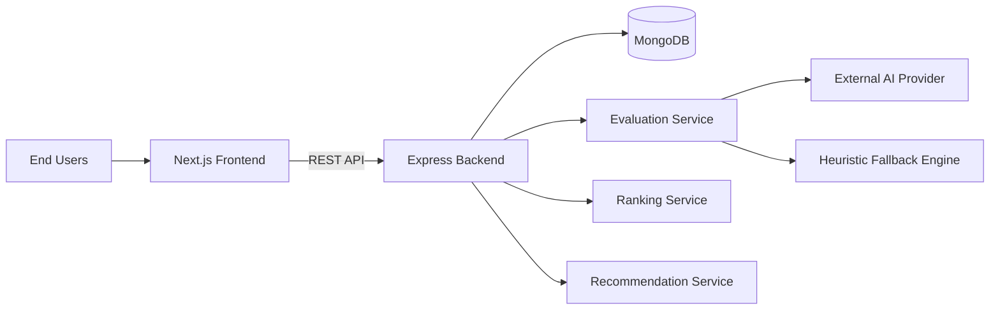
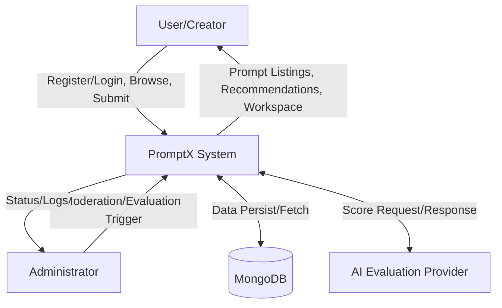
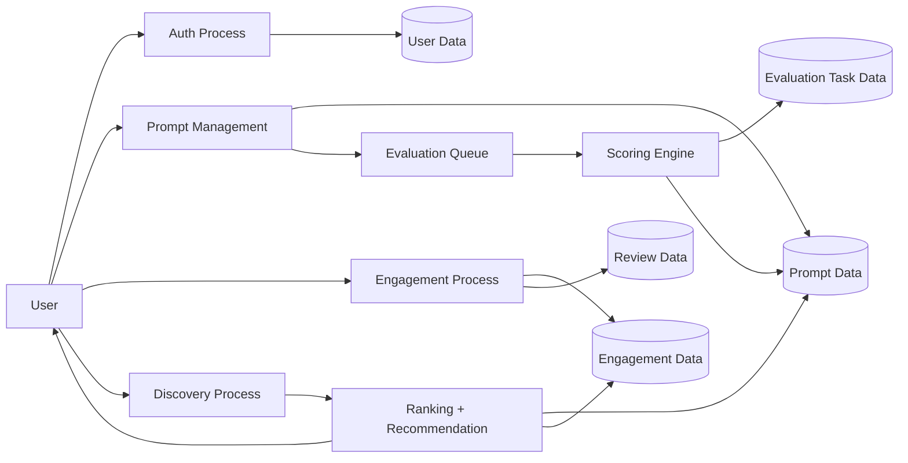
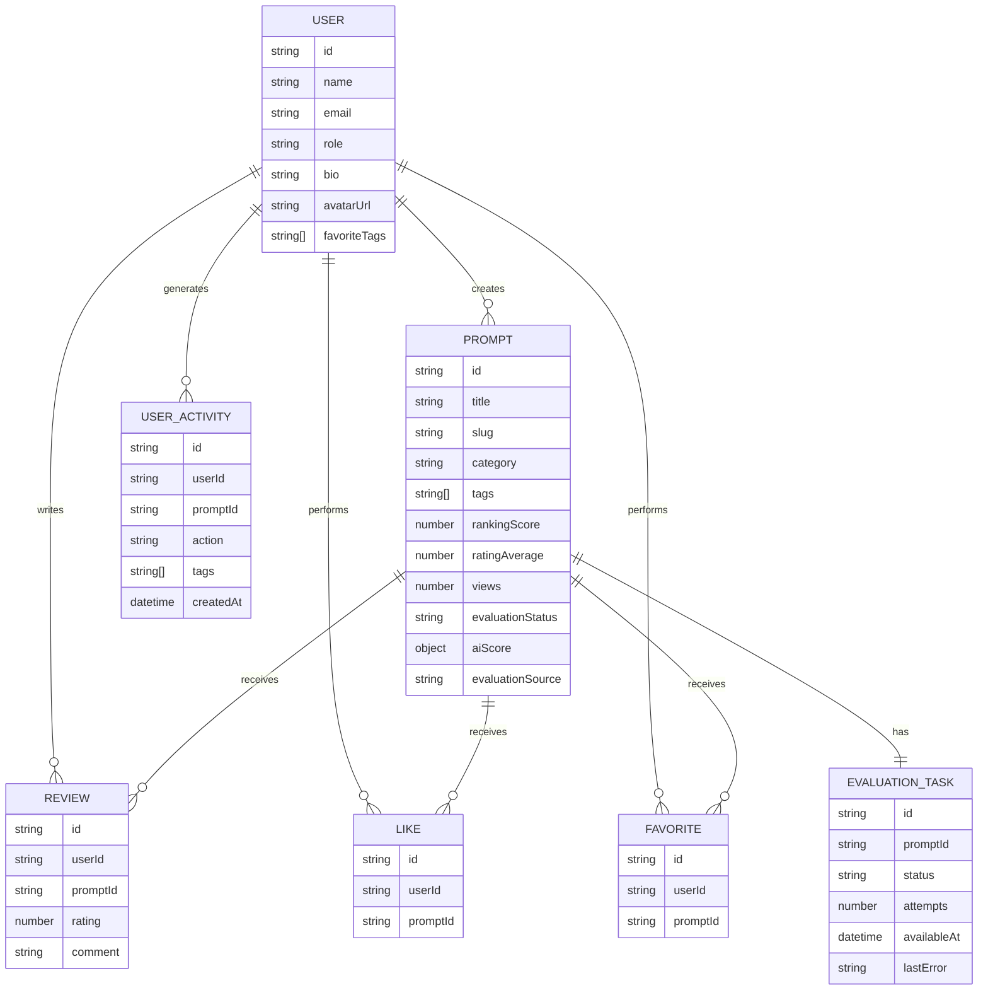
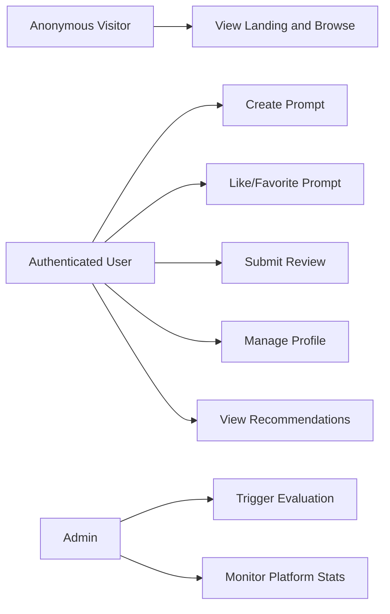
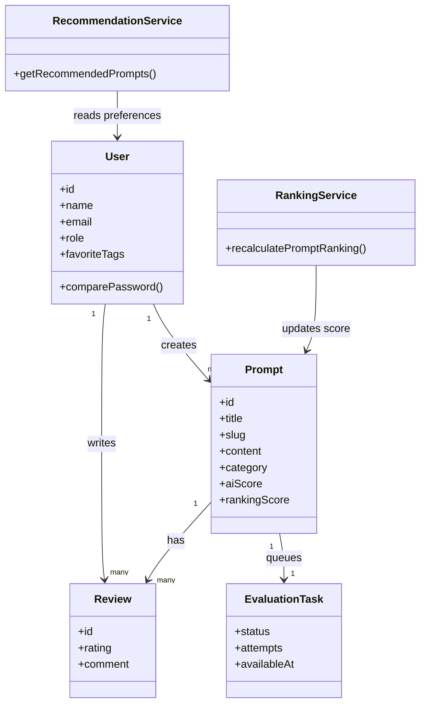
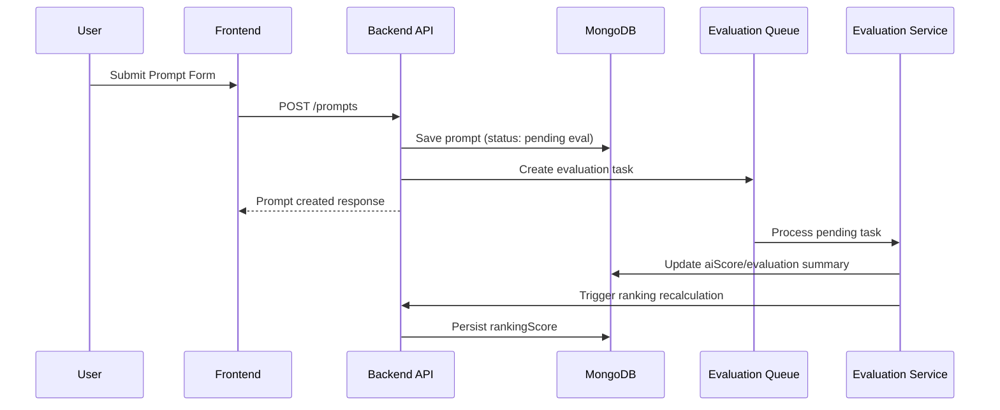
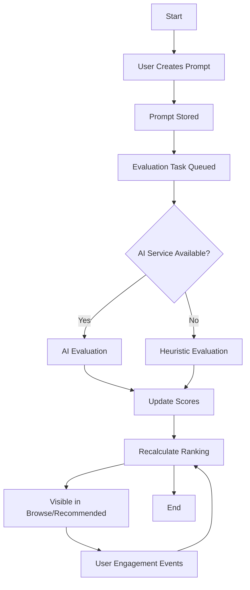
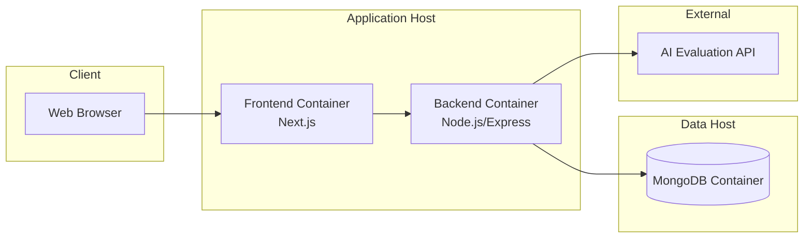

# CHAPTER 04: System Design

## 4.1 System Architecture
**Figure 4.1: High-Level System Architecture**

### Architecture Notes
- Frontend and backend are independently deployable services.
- Backend is the sole data access layer to MongoDB.
- Evaluation and ranking pipelines are asynchronous to protect request latency.

## 4.2 Data Flow Diagrams
**Figure 4.2: Context Diagram (DFD Level 0)**

**Figure 4.3: DFD Level 1**

## 4.3 Entity Relationship Diagram
**Figure 4.4: ER Diagram**

## 4.4 UML Diagrams
**Figure 4.5: UML Use Case Diagram**

**Figure 4.6: UML Class Diagram (Conceptual)**

**Figure 4.7: UML Sequence Diagram - Prompt Submission and Evaluation**

**Figure 4.8: UML Activity Diagram - Prompt Lifecycle**

**Figure 4.9: UML Deployment Diagram**

